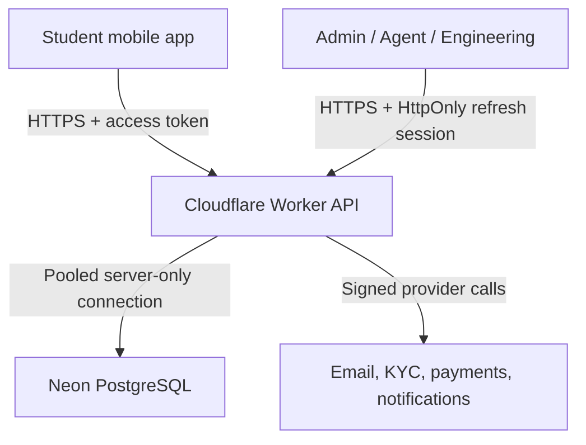

# Platform architecture

## Decision

KampusOne is a modular monolith: one Expo student app, one Next.js portal deployment with role-separated surfaces, one Cloudflare Worker API, and one Neon PostgreSQL database. Runtime secrets and production data stay outside Git. Every browser/mobile data request crosses the Worker; clients never hold a database credential.

## Deployable units

- `mobile`: Expo application with Today as home and authenticated student routes.
- `portal`: one Next.js deployment. Host-aware routing maps the admin, agent, and engineering domains to separately guarded workspaces.
- `server`: Hono Worker. It owns sessions, permissions, cross-record transactions, provider callbacks, scheduled expiry, and audit events.
- `database`: Neon PostgreSQL with forward migrations and private transaction functions.

## Feature boundaries

1. Identity, sessions, and institution membership
2. Academic structure, Today, timetable, and GPA
3. Campus directory and trusted editorial Feed
4. Tutorial listings, availability, bookings, completion, and disputes
5. Vendor catalogue, controlled checkout, inventory, and orders
6. Rider presence, assignments, handoff codes, and earnings
7. Payments, reconciliation, ledger, and payouts
8. Administration, moderation, release gates, and audit
9. Notifications, media, analytics, and later campus automation

Feature boundaries are module boundaries, not separate services. A split is justified only by measured scale, security isolation, or independent delivery needs.

## Request path

The Worker validates each access token, resolves active university and operator roles, validates every referenced record, checks feature/provider gates, performs consistency-sensitive work in PostgreSQL transactions, and records privileged activity. Provider webhooks are signature-verified and idempotent. Missing credentials cause an explicit unavailable response; they never activate a test path.

## Domain and environment plan

| Surface | Staging route | Production target |
| --- | --- | --- |
| Student mobile | Signed EAS internal build | App stores and production update channel |
| Admin | Staging portal `/admin` | `admin.kampusone.app` |
| Agents | Staging portal `/agents` | `agents.kampusone.app` |
| Engineering | Staging portal `/engineering` | `engineering.kampusone.app` |
| API | Staging Worker custom route | `api.kampusone.app` |

Production activation follows the gates in [the live-launch handoff](../phases/phase-1-3-live-handoff.md).
