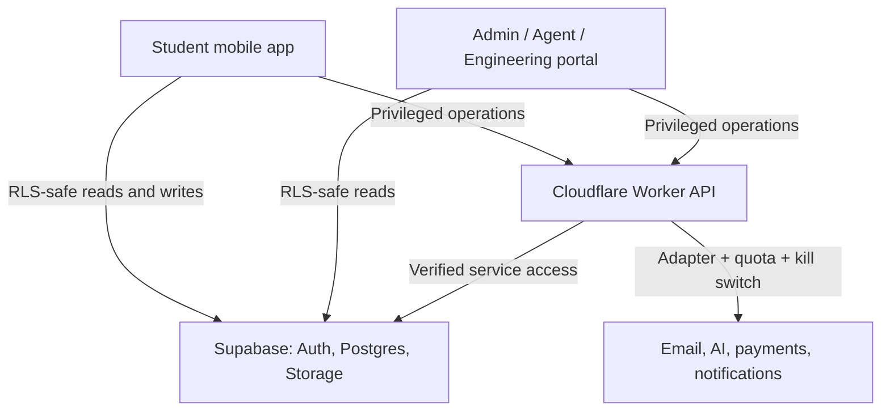

# Platform architecture

## Decision

KampusOne begins as a modular monolith: one public source repository, one Supabase PostgreSQL database, one student app, three separately released portal surfaces, and one thin privileged API. Runtime secrets and production data remain outside Git. Feature modules own their schema, contracts, and UI, without becoming separate services prematurely.

## Deployable units

- `mobile`: Expo application. Development uses a physical device or web export; distributable Android builds use EAS once the Expo project is connected.
- `portal`: one Next.js codebase released as three Vercel projects. `ops`, `agents`, and `build` have separate root experiences, environment configuration, approvals and authorization policies.
- `server`: Hono Worker. It owns secrets, provider callbacks, coordinated writes, and operations that must never run with a publishable client key.
- `database`: one Supabase project. All exposed tables use RLS; private operational data stays in a non-exposed schema or behind the Worker.

## Feature boundaries

1. Identity and institution membership
2. Academic structure and Today
3. Timetable and course coordination
4. Results and GPA planning
5. Campus directory, safety, and transport information
6. Tutorials and trusted campus services
7. Notifications and provider delivery
8. Agent operations and support
9. Administration, moderation, and audit
10. Social, marketplace, payments, and AI—independently gated behind readiness criteria

Feature boundaries are module boundaries, not service boundaries. A split is justified only by measured scale, security isolation, or independent delivery needs.

## Request paths

Ordinary user-scoped data can travel directly between a client and Supabase when RLS fully represents the rule. Requests go through the Worker when they require a secret, cross-record transaction, idempotency key, provider call, elevated permission, cost guard, or server-side audit event.

## Domain and environment plan

| Surface | Preview | Production target |
| --- | --- | --- |
| Student app | Expo development build / EAS artifact | Native stores plus `app.kampusone.app` on Cloudflare |
| Operations | Vercel preview | `ops.kampusone.app` |
| Agents | Vercel preview `/agents` | `agents.kampusone.app` |
| Build tracker | Vercel preview | `build.kampusone.app` |
| API | Wrangler preview URL | `api.kampusone.app` |

Production hostnames are not attached until authentication, role enforcement, audit logging, and a deployment review are complete.
